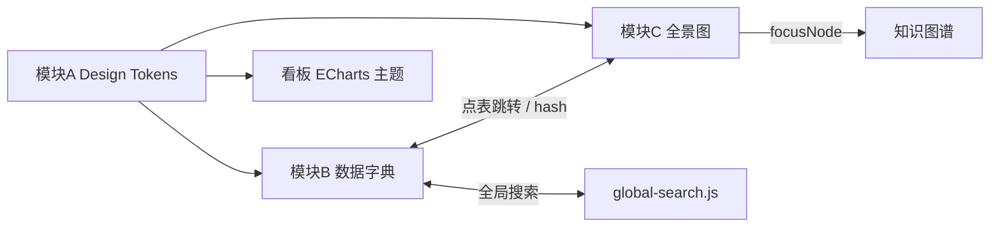

# 多行业数据平台 · 前端改造总方案

> 文档版本：v1.0 · 2026-08-10  
> 状态：方案设计（待实施）  
> 范围：`portfolio/` 主工程 · 不涉及数仓 DDL / 看板 API 逻辑变更  
> 子文档：  
> - [样式优化建议](./ui_style_optimization.md)  
> - [数据字典 Master-Detail 改造](./data_dictionary_refactor_plan.md)  
> - [数仓全景图视觉改造](./dw_architecture_visual_refactor.md)

---

## 1. 改造背景

多行业数据平台在**功能**上已具备：统一入口、三行业数仓、47 主题看板、六层方法论、数据字典、分层全景图、知识图谱。  

当前主要短板在**体验与工程**：

| 领域 | 典型问题 |
|------|----------|
| 视觉统一 | 入口页（Data Nexus 赛博风）与行业页（商务深蓝）割裂；CSS 三行业复制 |
| 数据字典 | 29+ 表纵向手风琴，定位慢；口径与字段分离 |
| 分层全景图 | 表卡片样式 Bug、连线过密、工具栏占首屏、DIM 列布局不合理 |
| 组件联动 | 全景图 / 图谱 / 字典 / 全局搜索各自为政 |

本总方案将上述三项整合为 **一条可分期落地的改造路线**，并明确依赖关系与验收标准。

---

## 2. 改造目标（SMART）

| # | 目标 | 验收 |
|---|------|------|
| G1 | 用户从入口进入任一行业，感知为「同一平台」 | 共享 Design Token；入口与内页有色彩/字体锚点 |
| G2 | 架构页「查表 → 看字段 → 看口径」≤ 3 次点击 | 字典 Master-Detail + 全景图点表跳转 |
| G3 | 全景图首屏可见五层结构，默认不「满屏线」 | 默认层间主箭头 ≤5 条；1080p 可见层头 |
| G4 | CSS 维护成本下降 | 三行业共用 core 文件，行业目录仅 accent 覆盖 |
| G5 | 不破坏现有静态部署与演示模式 | GitHub Pages / DEMO_MODE 回归通过 |

---

## 3. 三大改造模块

### 模块 A · 设计系统（Design System）

**文档详情：** [ui_style_optimization.md](./ui_style_optimization.md)

**核心动作：**

1. 新增 `portfolio/css/design-tokens.css`（平台色、行业 accent、L1–L6 层色、间距/圆角/字体）
2. 入口 `index.html` 样式外迁为 `landing.css`
3. 合并三份 `style.css` / `platform-features.css` 公共部分
4. ECharts `THEME.palette` 从 CSS 变量读取

**行业 accent 示例：**

| 行业 | `--color-accent` | 用途 |
|------|------------------|------|
| 零售 | `#34d399` | 顶栏下划线、KPI 高亮 |
| 互联网 | `#a78bfa` | 同上 |
| 制造 | `#fbbf24` | 同上 |

---

### 模块 B · 数据字典 Master-Detail

**文档详情：** [data_dictionary_refactor_plan.md](./data_dictionary_refactor_plan.md)

**核心动作：**

1. 左树：ODS / DIM / DWD / DWS / ADS → 表列表
2. 右详情：表元数据 + 字段表 + 字段抽屉（口径 / 血缘）
3. 深链：`#dict/{table}/{field?}`
4. Phase 2：`metric-caliber-data.js` 对接 `04_指标口径字典.md`

**明确不做：** 以分析 L1–L5 作为字典左侧主树（与表多对多冲突）。

**布局示意：**

```
┌─ 搜索 / 层筛选 / 统计 ─────────────────────────────┐
├─────────────┬──────────────────────────────────────┤
│ ODS ▼       │  dws_sales_daily                       │
│   ods_orders│  用途 · 血缘 · 消费看板                │
│ DWD ▼       │  ┌ 字段 │ 类型 │ 角色 │ 口径 ────────┐ │
│   …         │  └──────────────────────────────────┘ │
└─────────────┴──────────────────────────────────────┘
```

---

### 模块 C · 数仓分层全景图美化

**文档详情：** [dw_architecture_visual_refactor.md](./dw_architecture_visual_refactor.md)

**核心动作：**

1. **Phase 0 Bug：** 补齐 `dw-arch-table-name-cn/en` CSS；修复 SVG 坐标；架构页隐藏跨行业切换
2. **连线策略：** 默认 `layer` 模式（仅 ODS→DWD→DWS→ADS）；选中表 `focus` 模式；可选 `full`
3. **布局：** 主流程四列 + DIM 侧栏（或 category 分组折叠）
4. **视觉：** 列背景色带；ADS 改紫/青（弃 `#ef4444`）；工具栏三行合一
5. **联动：** 点表 → 字典 `selectTable`；点表 → 图谱 `focusNode`

**布局示意：**

```
[DIM 侧栏]  |  ODS ──→ DWD ──→ DWS ──→ ADS
            |   ▢▢▢      ▢▢▢      ▢▢▢      ▢▢▢
            |       层间总线 + 选中时高亮分支
```

---

## 4. 模块依赖关系



**建议顺序：**

1. **A-Phase 1** Token 文件（可与 C-Phase 0 并行）
2. **C-Phase 0** 全景图 Bug + 简线（最快见效）
3. **B-Phase 1** 字典 Master-Detail（零售试点）
4. **B ↔ C 联动** 点表跳字典
5. **A-Phase 2** CSS 合并
6. **C-Phase 2** 四列 + DIM 侧栏

---

## 5. 统一实施路线图

### 总览

| 阶段 | 周期 | 内容 | 产出 |
|------|------|------|------|
| **S0** | 0.5–1 天 | 全景图 Bug + 简线 + 卡片 CSS | 全景图可演示 |
| **S1** | 2–3 天 | 字典 Master-Detail（零售） | 字典可演示 |
| **S2** | 1–2 天 | Design Tokens + 全景图视觉 | 视觉统一起步 |
| **S3** | 2–3 天 | 字典/全景图三行业 + core 抽取 | 三行业一致 |
| **S4** | 2–3 天 | 全景图四列布局 + 口径 JSON | 架构页完整闭环 |
| **S5** | 1 天 | 回归 + 元数据版本（若改导航） | 可发布 |

**合计：约 8–12 人天**（单人 sequential；部分可并行）。

---

### S0 · 全景图急救（优先）

| 任务 | 文件 |
|------|------|
| 补 CSS 类名 | `*/css/dw-architecture.css` |
| `drawFlows('layer')` 默认简线 | `*/js/dw-architecture.js` |
| 架构页 `defaultIndustry` 固定当前行业，隐藏行业 Tab | `pages/architecture.html` + `dw-architecture.js` |
| ADS 层色改为 `#8b5cf6` | `dw-architecture-data.js` |

**验收：** 零售架构页首屏可见泳道；表卡片用途/表名层级清晰；默认连线 ≤5 条。

---

### S1 · 数据字典 Master-Detail（零售试点）

| 任务 | 文件 |
|------|------|
| 左树 + 右详情渲染 | `retail/js/data-dictionary.js` |
| 新样式 | `retail/css/data-dictionary.css`（或 `portfolio/css/`） |
| Hash 路由 `#dict/...` | 同上 |
| 搜索跳转 | `search-index-data.js`、`global-search.js` |

**验收：** 选表后页面高度稳定；搜索字段名直达表+字段。

---

### S2 · Design Tokens

| 任务 | 文件 |
|------|------|
| 新建 Token | `portfolio/css/design-tokens.css` |
| 入口外迁 | `portfolio/css/landing.css`、`index.html` |
| 零售引用 Token | `style.css` alias 旧变量 |
| 补 `.dd-layer-DIM` | `data-dictionary.css` / `platform-features.css` |

**验收：** 改一处主色，零售架构页 + 看板 header 同步变化。

---

### S3 · 三行业同步 + Core 抽取

| 任务 | 文件 |
|------|------|
| `data-dictionary-core.js` | `portfolio/js/` |
| `dw-architecture.js` 行业配置外置 | 三行业 `architecture.html` |
| `platform-features.css` dd-* → `data-dictionary.css` | 三行业 HTML link |
| internet / manufacturing 字典 + 全景图同步 | 对应 `js/`、`css/` |

**验收：** 三行业字典交互一致；CSS  diff 仅 accent 文件。

---

### S4 · 深度体验

| 任务 | 文件 |
|------|------|
| 全景图四列 + DIM 侧栏 | `dw-architecture.js` + CSS |
| 全景图 ↔ 字典联动 | `architecture.html` init |
| `export_metric_caliber.py` | `portfolio/scripts/` |
| 字典字段抽屉展示 SQL 口径 | `data-dictionary-core.js` |
| 可选 `pages/dictionary.html` 全屏 | 新页面 |

**验收：** 全景图点表 → 字典滚动并选中；度量字段有 business + technical 口径。

---

### S5 · 发布与元数据

若变更站点导航或 `dashboards.json`：

```bash
cd portfolio
python scripts/export_portfolio_config.py --version v3.3 --notes "前端改造：字典Master-Detail+全景图+DesignTokens"
python scripts/apply_version_sql.py --version v3.3 --notes "同上"
```

**回归清单：**

- [ ] `portfolio/index.html` 行业卡片正常
- [ ] 三行业 `*_dashboard.html` KPI 加载（demo + API）
- [ ] `architecture.html` 全景图 + 字典 + 图谱
- [ ] 全局搜索表/字段/看板
- [ ] GitHub Pages 静态模式 `DEMO_MODE`
- [ ] PDF `report.html` 打印预览无溢出

---

## 6. 关键文件矩阵

| 文件 | 模块 | 改造类型 |
|------|------|----------|
| `portfolio/css/design-tokens.css` | A | **新建** |
| `portfolio/css/landing.css` | A | **新建** |
| `portfolio/css/data-dictionary.css` | B | **新建**（从 platform-features 拆） |
| `portfolio/js/data-dictionary-core.js` | B | **新建** |
| `portfolio/industries/*/js/data-dictionary.js` | B | 重构 → 薄封装 |
| `portfolio/industries/*/js/dw-architecture.js` | C | 重构（布局+连线） |
| `portfolio/industries/*/css/dw-architecture.css` | C | 增补+修复 |
| `portfolio/industries/*/js/dw-architecture-data.js` | C | ADS 改色、category 分组 |
| `portfolio/industries/*/js/search-index-data.js` | B | anchor/hash 更新 |
| `portfolio/industries/*/js/global-search.js` | B | dictNavigate |
| `portfolio/industries/*/js/dashboard-core.js` | A | palette 读 Token |
| `portfolio/industries/*/css/style.css` | A | 合并/alias |
| `portfolio/industries/*/css/platform-features.css` | A/B | 瘦身 |
| `portfolio/industries/*/pages/architecture.html` | B/C | section 顺序、init 联动 |
| `retail-finance-analysis/scripts/generate_sql6_dictionary_js.py` | B | 可选 used_by_dashboards |
| `portfolio/scripts/export_metric_caliber.py` | B | **新建**（Phase 2） |

---

## 7. 架构页信息架构（改造后）

建议 section 顺序与分工：

| 顺序 | Section | 用户问题 | 交互 |
|------|---------|----------|------|
| 1 | 分层全景图 | 数据怎么分层流？ | 点表 → 侧栏 / 跳字典 |
| 2 | 数据字典 | 字段定义与口径？ | 左树选表 → 右详情 |
| 3 | 知识图谱 | 复杂血缘关系？ | 力导向，点节点高亮链 |
| 4 | ER 图 | 实体关系？ | 静态/可缩放 |
| 5 | 应用层映射 | 看板消费哪些 ADS？ | 表格 |
| 6 | ETL / 血缘说明 | 管道怎么跑？ | 文档 |

避免：四个图形组件堆叠却无跳转关系。

---

## 8. 交互规范（跨模块统一）

| 规范 | 说明 |
|------|------|
| 单击选中 | 表/字段/节点均用单击，不用双击 |
| 深链 Hash | 字典 `#dict/{t}/{f?}`；全景 `#arch/{t}`（可选） |
| 层色 Token | ODS/DIM/DWD/DWS/ADS 全站同色，字典 badge = 全景图列 = 图谱节点 |
| 侧栏 | 全景图用画布内嵌 panel（400px），字典用 Master-Detail，避免全屏遮罩 |
| 搜索 | 顶栏全局搜索为统一入口，结果分类：看板 / 表 / 字段 / 指标 / 分析问题 |
| 行业 | 架构页内不切换行业；仅平台入口或独立预览页可切换 |

---

## 9. 风险与对策

| 风险 | 对策 |
|------|------|
| 三行业 JS 再次分叉 | S3 强制抽 core，PR 禁止复制粘贴整文件 |
| 口径双维护 | Markdown 为源，脚本导出 JS；字段只存 `caliber_id` |
| 全景图改布局后连线算法失效 | 分阶段：先简线后改布局；每步截图对比 |
| 静态站 global-search 跳 hash 失败 | `sessionStorage.dictNav` 双保险 |
| 改造范围蔓延 | 不改 DDL、不改看板 SQL、不改 API 契约 |

---

## 10. 优先级矩阵（跨模块）

| 优先级 | 项 | 模块 | 收益/成本 |
|--------|-----|------|-----------|
| **P0** | 全景图卡片 CSS Bug + 默认简线 | C | 极高 / 极低 |
| **P0** | 字典 Master-Detail（零售） | B | 高 / 中 |
| **P0** | Design Tokens 单文件 | A | 高 / 低 |
| **P1** | 全景图 ↔ 字典联动 | B+C | 高 / 低 |
| **P1** | 架构页隐藏跨行业切换 | C | 中 / 极低 |
| **P1** | CSS 三行业 dedupe | A | 高 / 中 |
| **P2** | 全景图四列 + DIM 侧栏 | C | 高 / 高 |
| **P2** | 指标口径 JSON | B | 中 / 中 |
| **P3** | 全屏 dictionary.html | B | 低 / 低 |
| **P3** | 亮色主题 | A | 低 / 高 |

---

## 11. 不建议事项

1. 引入 React/Vue/Tailwind 重写前端  
2. 用分析 L1–L5 作数据字典左侧树  
3. 删除全景图只留知识图谱  
4. 全景图默认画全量血缘  
5. 在未同步 `retail-finance-analysis/docs/` 副本前只改 portfolio 一处（Impact Sync 规则）

---

## 12. 文档索引

| 文档 | 内容 |
|------|------|
| **本文** | 总方案、路线图、依赖、文件矩阵 |
| [ui_style_optimization.md](./ui_style_optimization.md) | Token 定义、组件规范、响应式断点 |
| [data_dictionary_refactor_plan.md](./data_dictionary_refactor_plan.md) | 字典 API、数据扩展、测试清单 |
| [dw_architecture_visual_refactor.md](./dw_architecture_visual_refactor.md) | 全景图布局、连线算法、验收标准 |

---

## 13. 下一步行动

**推荐立即启动（S0，半天）：**

1. 修复 `dw-architecture.css` 表卡片类名  
2. `drawFlows` 增加 `mode='layer'` 默认  
3. 零售 `architecture.html` 隐藏全景图行业切换  

**随后（S1，2–3 天）：**

4. 零售 `data-dictionary.js` Master-Detail 原型  

完成 S0+S1 即可在作品集演示中展示「可读的架构页」。

---

*实施完成后请执行 Impact Sync 自检（数仓 ↔ 看板 ↔ 方法论 ↔ 元数据），并在变更导航/配置时递增 `portfolio_metadata` 版本。*
